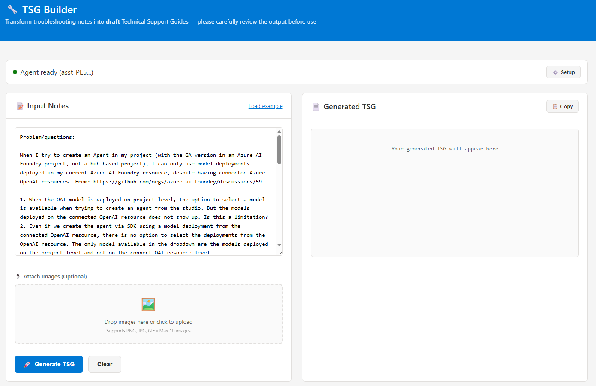

# TSG Builder – Agent-based Troubleshooting Guide Generator

Transform raw troubleshooting notes into structured **Technical Support Guides (TSGs)** using an Azure AI Foundry Agent with Bing Search and Microsoft Learn MCP integration.

## Why TSG Builder?

Writing high-quality troubleshooting guides is essential to Support knowledge curation, but tedious. In fast-moving areas like Azure AI Support, new issues emerge constantly, each requiring a new TSG. 

TSG Builder was born out of this frustration. The idea: **you provide a raw dump of info to start from, the tool researches and formats**.

- **Human + AI collaboration** — You curate initial notes from cases, threads with engineering, incidents; the agent enhances them with research from public docs like Microsoft Learn and relevant GitHub discussions
- **Fits existing workflows** — Support and supportability teams already review common issues to identify TSG candidates; those notes become your input
- **Broadly applicable** — Agnostic to team, technology, or support area

## Table of Contents

- [Overview](#overview)
- [Quick Start](#quick-start)
- [Web UI](#web-ui)
- [Prerequisites](#prerequisites)
- [Installation](#installation)
- [Configuration](#configuration)
- [Makefile Commands](#makefile-commands)
- [How It Works](#how-it-works)
- [Troubleshooting](#troubleshooting)
- [Architecture](#architecture)
- [Files](#files)
- [Contributing](#contributing)
- [License](#license)

## Overview

TSG Builder uses Azure AI Foundry v2 Agents to:
1. **Research** the issue using Bing Search and Microsoft Learn MCP
2. **Generate** a structured TSG following your team's template
3. **Iterate** by asking follow-up questions for missing information
4. **Output** a high-quality markdown TSG draft

Source template: [TSG-Template.md - ADO](https://dev.azure.com/Supportability/AzureCognitiveServices/_git/AzureML?path=/AzureML/Welcome/TSG-Template.md&version=GBmaster&_a=preview)

## Quick Start

> See [Prerequisites](#prerequisites) for Windows/PowerShell instructions 

```bash
# 1. Clone and setup
git clone <repo-url>
cd tsgbuilder
make setup

# 2. Start the Web UI
make ui
# Open http://localhost:5000 in your browser
```

The web UI will automatically open the setup wizard if configuration is needed. The setup wizard guides you through:
1. **Configure** — Enter your Azure AI Foundry settings
2. **Validate** — Verify authentication and connectivity
3. **Create Agents** — Create the three pipeline agents (Researcher, Writer, Reviewer)

## Web UI

The web interface is the recommended way to use TSG Builder:

```bash
make ui
```

Then open **http://localhost:5000** in your browser.

> ⏱️ **Timing**: A full run (Research → Write → Review) typically takes **2–5 minutes** depending on the complexity of your input and the amount of research needed. The UI shows real-time progress for each stage.

> ⚠️ **Note**: This web UI is intended for local development use only. Do not expose it to the internet without adding proper authentication and security measures.

> ⚠️ **Note**: This tool uses an Azure AI Agent to search the internet. Be mindful of customer data; it should never be in your input notes or input images. 

**Features:**
- ⚙️ **Built-in setup wizard** — Configure, validate, and create agents from the browser
- 📝 Paste notes directly in the browser
- �️ **Image support** — Attach screenshots via drag-and-drop, file picker, or paste
- 🔄 Interactive follow-up questions
- 📋 One-click copy to clipboard- 👁️ **Raw/Preview toggle** — Switch between raw markdown (for copy/paste) and rendered preview- 📊 Real-time status indicator
- 💡 Load example input with one click

### Attaching Images

You can include screenshots or images with your troubleshooting notes:

1. **Drag and drop** — Drag image files onto the upload zone
2. **Click to upload** — Click the upload zone to open file picker

Supported formats: PNG, JPG, GIF, WebP. Maximum 10 images per request.

Images are sent to the AI agent for visual analysis, which is especially useful for:
- Error screenshots
- Architecture diagrams
- Console/terminal output
- Configuration screenshots



## Prerequisites

### Azure Resources Required

| Resource | Purpose | How to Get |
|----------|---------|------------|
| **Azure AI Foundry Project** | Hosts the agent | [Create a project](https://learn.microsoft.com/azure/ai-foundry/how-to/create-projects) |
| **Model Deployment** | LLM for the agent (recommended: `gpt-5.2`) | Deploy in your project |
| **Bing Search Connection** | Web research capability | [Connect Bing Search](https://learn.microsoft.com/azure/ai-foundry/how-to/connections-add) |

### Local Requirements

- Python 3.9+
- GNU Make
- Azure CLI (logged in with `az login`)
- Access to an Azure AI Foundry project

> **Recommended**: Linux or WSL 2 (Make and other tools work out of the box).
>
> **Windows (PowerShell)**: Install Make and add to PATH:
> ```powershell
> winget install GnuWin32.Make
> [Environment]::SetEnvironmentVariable("Path", $env:Path + ";C:\Program Files (x86)\GnuWin32\bin", "User")
> ```
> Then **restart PowerShell** for the PATH change to take effect.

## Installation

```bash
make setup
```

This will:
- Create a virtual environment (`.venv/`)
- Install dependencies
- Copy `.env-sample` to `.env`

## Configuration

Run `make ui` and open http://localhost:5000

1. Click the **⚙️ Setup** button (or it opens automatically)
2. Enter your Azure configuration values
3. Click **Save Configuration**
4. Run **Validation** to verify everything works
5. Click **Create Agents**

### Finding Your Configuration Values

#### PROJECT_ENDPOINT
1. Go to [Azure Portal](https://portal.azure.com)
2. Navigate to your AI Foundry resource
3. Select your project
4. Copy the endpoint from the Overview page

#### BING_CONNECTION_NAME
1. Go to [AI Foundry Portal](https://ai.azure.com)
2. Open Management Center
3. Go to Connected Resources
4. Find your Bing Search connection
5. Copy the full resource ID

#### MODEL_DEPLOYMENT_NAME
1. In AI Foundry Portal, go to Deployments
2. Use the name of your deployed model (e.g., `gpt-5.2`)

## Makefile Commands

| Command | Description |
|---------|-------------|
| `make setup` | First-time setup (venv + deps + .env) |
| `make ui` | **Start the web UI** at http://localhost:5000 |
| `make validate` | Check environment configuration (CLI troubleshooting) |
| `make install` | Install dependencies only |
| `make clean` | Remove venv and generated files |
| `make clean DELETE_AGENTS=1` | Also delete agents from Azure before cleaning |
| `make lint` | Check Python syntax |
| `make help` | Show all commands |

## How It Works

TSG Builder uses a **three-stage pipeline**: Research → Write → Review.

```
┌─────────────┐    ┌─────────────┐    ┌─────────────┐    ┌─────────────┐
│  RESEARCH   │───▶│    WRITE    │───▶│   REVIEW    │───▶│   OUTPUT    │
│  🔍         │    │   ✏️         │    │   🔎        │    │   ✅        │
└─────────────┘    └─────────────┘    └─────────────┘    └─────────────┘
  Uses tools        No tools           Validates          Final TSG
  (Bing, MCP)       Just writes        & fact-checks
```

1. **Research** — Searches Microsoft Learn and Bing for documentation, GitHub issues, and community solutions
2. **Write** — Generates the TSG using only your notes + research (no tool access = no hallucinated searches)
3. **Review** — Validates structure and fact-checks against research; auto-fixes or retries if needed

If information is missing, the agent inserts `{{MISSING::...}}` placeholders and asks follow-up questions.

For detailed architecture information, see [docs/architecture.md](docs/architecture.md).

## Troubleshooting

### "PROJECT_ENDPOINT is required"
- Ensure `.env` file exists and contains `PROJECT_ENDPOINT`
- Run `make validate` to check all variables

### "Azure authentication failed"
- Ensure Azure CLI is installed ([Install Azure CLI](https://learn.microsoft.com/cli/azure/install-azure-cli))
- Run `az login` to authenticate
- Ensure your account has access to the AI Foundry project

### "Failed to connect to project"
- Verify `PROJECT_ENDPOINT` is correct
- Check you have the "Azure AI User" role on the project

### "Agent not found"
- Open the web UI and use the Setup wizard to create the agents
- Check `.agent_ids.json` file exists

### Agent doesn't use tools / research
- The agent instructions mandate research before output
- If this persists, recreate the agent via the Setup wizard in the web UI

### TSG missing documentation links
- The agent is instructed to include URLs from research in "Related Information"
- Check the agent is correctly configured with both Bing and Learn MCP tools

## Architecture

See [docs/architecture.md](docs/architecture.md) for detailed pipeline architecture, stage descriptions, and design decisions.

## Files

| File | Purpose |
|------|---------|
| `web_app.py` | Flask web UI server (includes agent creation) |
| `pipeline.py` | **Multi-stage pipeline orchestration** (Research → Write → Review) |
| `validate_setup.py` | Validate environment configuration (CLI troubleshooting) || `delete_agents.py` | Delete agents from Azure (used by `make clean DELETE_AGENTS=1`) || `tsg_constants.py` | TSG template, agent instructions, and stage prompts |
| `Makefile` | Common operations |
| `.env` | Your configuration (git-ignored) |
| `.env-sample` | Configuration template |
| `.agent_ids.json` | Pipeline agent IDs after creation |
| `.sessions/` | Persisted sessions for follow-up questions (git-ignored) |
| `input-example.txt` | Example input notes |
| `templates/index.html` | Web UI template |

## Contributing

1. Fork the repository
2. Create a feature branch
3. Make your changes
4. Run `make lint` to check syntax
5. Submit a pull request

## License

MIT
