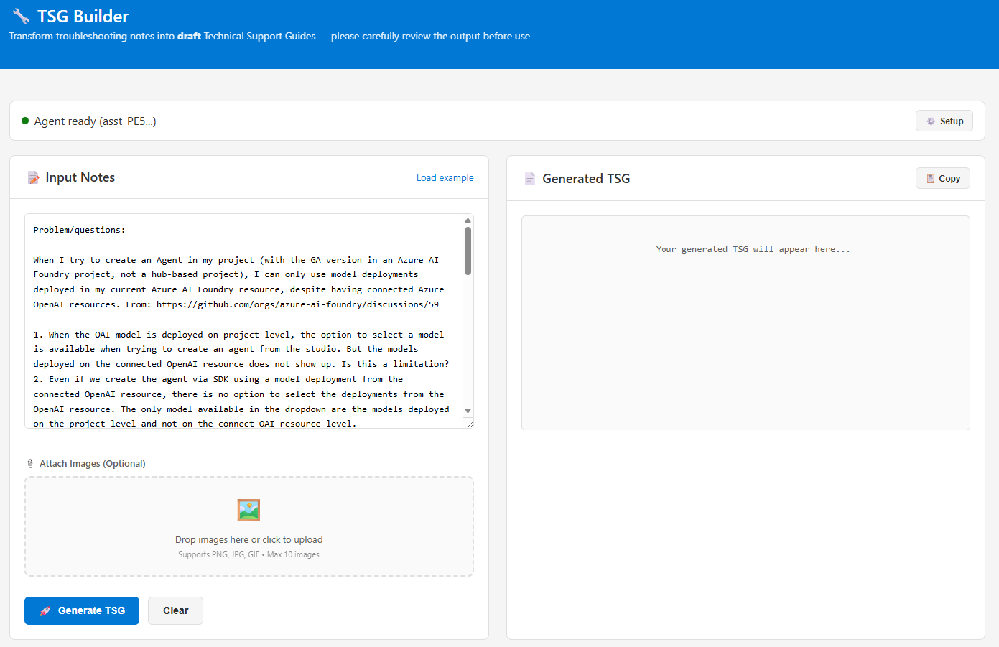

# TSG Builder – Troubleshooting Guide Generator

Turn raw troubleshooting notes into polished **Technical Support Guides (TSGs)** in minutes. TSG Builder uses a multi-agent pipeline to research, write, and review your TSGs automatically.

## Why TSG Builder?

Writing high-quality troubleshooting guides is essential to Support knowledge curation, but tedious. In fast-moving areas like Azure AI Support, new issues emerge constantly, each requiring a new TSG for ease-of-reference by Support Engineers and AI-based support tools.

TSG Builder was born out of this need. The idea: **you provide a raw dump of info to start from, the tool researches and formats**.

- **Human + AI collaboration** — You curate initial notes from cases, threads with engineering, incidents; the agent enhances them with research from public docs like Microsoft Learn and relevant GitHub discussions
- **Fits existing workflows** — Support and supportability teams already review common issues to identify TSG candidates; those notes become your input
- **Broadly applicable** — Agnostic to team, technology, or support area

## Table of Contents

- [Quick Start](#quick-start)
- [Prerequisites](#prerequisites)
- [Using TSG Builder](#using-tsg-builder)
- [Configuration](#configuration)
- [How It Works](#how-it-works)
- [Troubleshooting](#troubleshooting)
- [Telemetry](#telemetry)
- [Development](#development)
- [License](#license)

## Quick Start

### Option 1: Download & Run (Recommended)

> **Prerequisites**: [Azure CLI](https://learn.microsoft.com/cli/azure/install-azure-cli) logged in (`az login`) + [Azure AI Foundry project](#azure-resources-required)

#### Windows — Installer (recommended)

1. **Download** `tsg-builder-windows-setup.zip` from [Releases](../../releases)
2. Extract the zip, then run **`tsg-builder-windows-setup.exe`**
   - Installs to your user profile (no admin required), creates Start Menu and desktop shortcuts
   - Handles upgrades automatically — just re-run the installer when a new version is available
3. Launch **TSG Builder** from the Start Menu or desktop shortcut
4. Your browser opens to `http://localhost:5000` — complete setup and click **Create Agents**

> **First run:** SmartScreen may warn about an unrecognized app — click **More info** → **Run anyway**. First launch may be slow due to Defender scanning.

#### Windows — Portable / Linux / macOS

1. **Download** the zip for your platform from [Releases](../../releases):
   | Platform | File |
   |----------|------|
   | Windows (portable) | `tsg-builder-windows.zip` |
   | Linux | `tsg-builder-linux.zip` |
   | macOS | `tsg-builder-macos.zip` |

2. **Extract and run**:
   ```bash
   # Linux/macOS: Make executable after extracting
   chmod +x tsg-builder-linux   # or tsg-builder-macos
   ./tsg-builder-linux
   ```
   On Windows, run `tsg-builder-windows.exe`. Your browser opens to `http://localhost:5000`.

   > **macOS**: Right-click → "Open" → "Open" to bypass Gatekeeper on first launch.

3. **Complete setup** in the browser — enter your Azure AI Foundry endpoint and click **Create Agents**

### Option 2: Run from Source

<details>
<summary>Click to expand developer instructions</summary>

Requires Python 3.11+, GNU Make, and Azure CLI.

```bash
# 1. Clone and setup
git clone <repo-url>
cd tsgbuilder
make setup

# 2. Start the Web UI
make ui
# Opens http://localhost:5000 in your browser
```

The setup wizard opens automatically to guide you through configuration.

> **Windows (PowerShell)**: Install Make first:
> ```powershell
> winget install GnuWin32.Make
> [Environment]::SetEnvironmentVariable("Path", $env:Path + ";C:\Program Files (x86)\GnuWin32\bin", "User")
> ```
> Then restart PowerShell.

</details>

## Prerequisites

### Azure Resources Required

| Resource | Purpose | How to Get |
|----------|---------|------------|
| **Azure AI Foundry Project** | Hosts the agent | [Create a project](https://learn.microsoft.com/azure/ai-foundry/how-to/create-projects) |
| **Model Deployment** | LLM for the agent (recommended: `gpt-5.2`) | Deploy in your project |

### Local Requirements

- **Azure CLI** — Logged in with `az login` ([Install Azure CLI](https://learn.microsoft.com/cli/azure/install-azure-cli))
- **For source builds only**: Python 3.11+, GNU Make

## Using TSG Builder

> ⏱️ **Timing**: A full run (Research → Write → Review) typically takes **2–5 minutes** depending on the complexity of your input and the amount of research needed.

> ⚠️ **Note**: This tool uses a Foundry Agent to search the internet. A built-in **PII check** scans your input before generation and blocks any content containing emails, phone numbers, IP addresses, credentials, or other customer-identifiable information. You'll be prompted to edit or redact before proceeding.

**Features:**
- ⚙️ **Built-in setup wizard** — Configure, validate, and create agents from the browser
- 📝 Paste notes directly in the browser
- 🖼️ **Image support** — Attach screenshots via drag-and-drop, file picker, or paste
- 🔄 Interactive follow-up questions
- 📋 One-click copy to clipboard
- 👁️ **Raw/Preview toggle** — Switch between raw markdown and rendered preview
- 📊 Real-time status indicators
- 💡 Load example input with one click

### Attaching Images

You can include screenshots or images with your troubleshooting notes:

1. **Drag and drop** — Drag image files onto the upload zone
2. **Click to upload** — Click the upload zone to open file picker

Supported formats: PNG, JPG, GIF, WebP. Maximum 10 images per request.

Images are sent to the AI agent for visual analysis, which is especially useful for:
- Error screenshots
- Architecture diagrams
- Console/terminal output
- Configuration screenshots



## Configuration

The setup wizard (opens automatically on first run) guides you through configuration:

1. Click the **⚙️ Setup** button (or it opens automatically)
2. Enter your Azure configuration values
3. Click **Save Configuration**
4. Run **Validation** to verify everything works
5. Click **Create Agents**

### Finding Your Configuration Values

#### PROJECT_ENDPOINT
1. Go to [Azure Portal](https://portal.azure.com)
2. Navigate to your AI Foundry resource
3. Select your project
4. Copy the endpoint from the Overview page

#### MODEL_DEPLOYMENT_NAME
1. In AI Foundry Portal, go to Deployments
2. Use the name of your deployed model (e.g., `gpt-5.2`)

## How It Works

TSG Builder uses a **three-stage pipeline**: Research → Write → Review.

```
┌─────────────┐    ┌─────────────┐    ┌─────────────┐    ┌─────────────┐
│  RESEARCH   │───▶│    WRITE    │───▶│   REVIEW    │───▶│   OUTPUT    │
│  🔍         │    │   ✏️         │    │   🔎        │    │   ✅        │
└─────────────┘    └─────────────┘    └─────────────┘    └─────────────┘
  Uses tools        No tools           Validates          Final TSG
  (Web, MCP)         Just writes        & fact-checks
```

1. **Research** — Searches Microsoft Learn and the web for documentation, GitHub issues, and community solutions
2. **Write** — Generates the TSG using only your notes + research (no tool access = no hallucinated searches)
3. **Review** — Validates structure and fact-checks against research; auto-fixes or retries if needed

If information is missing, the agent inserts `{{MISSING::...}}` placeholders and asks follow-up questions.

Output follows the [DFM-copilot-optimized TSG template](https://dev.azure.com/Supportability/AzureCognitiveServices/_git/AzureML?path=/AzureML/Welcome/TSG-Template.md&version=GBmaster&_a=preview). For detailed architecture information, see [docs/architecture.md](docs/architecture.md).

## Troubleshooting

### "PROJECT_ENDPOINT is required"
- Ensure `.env` file exists and contains `PROJECT_ENDPOINT`
- The executable creates `.env` automatically on first run

### "Azure authentication failed"
- Ensure Azure CLI is installed ([Install Azure CLI](https://learn.microsoft.com/cli/azure/install-azure-cli))
- Run `az login` to authenticate
- Ensure your account has access to the AI Foundry project

### "Failed to connect to project"
- Verify `PROJECT_ENDPOINT` is correct
- Check you have the "Azure AI User" role on the project

### "Agent not found"
- Open the web UI and use the Setup wizard to create the agents
- Check `.agent_ids.json` file exists in the same directory as the executable

### Agent doesn't use tools / research
- The agent instructions mandate research before output
- If this persists, recreate the agent via the Setup wizard

### TSG missing documentation links
- The agent is instructed to include URLs from research in "Related Information"
- Check the agent is correctly configured with both Bing and Learn MCP tools

### "PII check failed: authentication error"
- The PII check uses the AI Services endpoint from your Foundry resource (derived from `PROJECT_ENDPOINT`)
- Run `az login` to refresh your credentials
- Ensure your account has access to your Foundry project

### PII check flags a false positive
- The `Person` category may occasionally flag Azure service names or technical terms
- Click **"Go Back & Edit"** to adjust your notes, or **"Redact & Continue"** to accept the automatic redaction
- If a category consistently produces false positives, maintainers can adjust `PII_CATEGORIES` in `pii_check.py`

---

## Telemetry

TSG Builder collects **anonymous usage telemetry** to help improve the tool. Telemetry is enabled by default in release binaries and can be fully disabled.

### What Is Collected

- **Counts and enums** — event names (e.g. "TSG generated", "setup completed"), stage names, error classifications
- **Durations** — pipeline and per-stage wall-clock times
- **Token counts** — per-stage input/output token usage (aggregate numbers, never content)
- **Version and platform** — app version, OS platform, Python version, run mode (source/executable)
- **Install ID** — a random UUID generated on first run, stored in `.env` as `TSG_INSTALL_ID`. Not derived from any machine, user, or network identifier

### What Is Never Collected

- Notes, TSG content, or any user-authored text
- Error messages containing user content
- PII of any kind
- File paths, Azure resource names, endpoints, or credentials
- IP addresses or network identifiers

### How to Opt Out

Set `TSG_TELEMETRY=0` in your `.env` file (same directory as the executable or project root):

```
TSG_TELEMETRY=0
```

Or set the environment variable before running:

```bash
TSG_TELEMETRY=0 ./tsg-builder-linux
```

When opted out:
- No events are emitted
- No `install_id` is generated or persisted
- The app behaves identically otherwise

---

## Development

<details>
<summary>Building from source, contributing, and architecture details</summary>

### Building the Executable

```bash
make build
```

This creates executables in `dist/`:
- **Linux**: `dist/tsg-builder-linux`
- **macOS**: `dist/tsg-builder-macos`
- **Windows**: `dist/tsg-builder-windows.exe`

### Makefile Commands

| Command | Description |
|---------|-------------|
| `make setup` | First-time setup (venv + dependencies) |
| `make ui` | Start the web UI at http://localhost:5000 |
| `make build` | Build standalone executable with PyInstaller |
| `make validate` | Check environment configuration (CLI troubleshooting) |
| `make install` | Install dependencies only (assumes venv exists) |
| `make install-dev` | Install dev dependencies (pytest, etc.) |
| `make clean` | Remove venv and generated files |
| `make clean DELETE_AGENTS=1` | Also delete agents from Azure before cleaning |
| `make lint` | Check Python syntax |
| `make test` | Run the test suite |
| `make test-verbose` | Run tests with verbose output |
| `make test-cov` | Run tests with coverage report |
| `make test-unit` | Run only unit tests (fast) |
| `make test-quick` | Skip dep install (fastest) |
| `make help` | Show all commands |

### Architecture

See [docs/architecture.md](docs/architecture.md) for detailed pipeline architecture, stage descriptions, and design decisions.

### Files

| File | Purpose |
|------|---------|
| `web_app.py` | Flask web UI server (includes agent creation) |
| `pipeline.py` | Multi-stage pipeline orchestration (Research → Write → Review) |
| `pii_check.py` | PII detection via Azure AI Language API (pre-flight gate) |
| `error_utils.py` | Shared Azure SDK error classification utilities |
| `telemetry.py` | Anonymous usage telemetry (see [docs/telemetry.md](docs/telemetry.md)) |
| `version.py` | Single source of truth for version, GitHub URL, and TSG signature |
| `build_exe.py` | PyInstaller build script (bundles templates/, static/) |
| `tsg_constants.py` | TSG template, agent instructions, and stage prompts |
| `validate_setup.py` | Validate environment configuration (CLI troubleshooting) |
| `delete_agents.py` | Delete agents from Azure (used by `make clean DELETE_AGENTS=1`) |
| `Makefile` | Common operations |
| `.env` | Your configuration (git-ignored, auto-created on first run) |
| `.agent_ids.json` | Pipeline agent IDs after creation |
| `templates/index.html` | Web UI HTML structure |
| `static/css/styles.css` | Web UI styles |
| `static/js/main.js` | Core UI logic (streaming, TSG generation, images, PII modal) |
| `static/js/setup.js` | Setup modal functionality |
| `tests/` | Pytest test suite with fixtures |

### Contributing

1. Fork the repository
2. Create a feature branch
3. Make your changes
4. Run `make lint` to check syntax
5. Run `make test` to verify tests pass
6. Submit a pull request

### Creating a Release

Releases are built automatically by GitHub Actions when a version tag is pushed:

```bash
# Create and push a tag
git tag v1.0.0          # or v1.0.0-beta.1 for pre-release
git push origin v1.0.0
```

This triggers a workflow that:
1. Builds executables for Linux, macOS, and Windows
2. Generates SHA256 checksums
3. Creates a **draft release** with all files attached

After the workflow completes, go to the [Releases page](../../releases) to review and publish.

</details>

### Maintainer Notes: PII Detection

<details>
<summary>Click to expand PII detection details (project maintainers only)</summary>

TSG Builder includes a pre-flight PII check powered by the **Azure AI Language PII API** via the AI Services endpoint built into each user's Foundry resource. End users need no additional setup — the PII endpoint is derived from the `PROJECT_ENDPOINT` they already configure.

#### How It Works

- **Endpoint derivation**: `pii_check.py` extracts the AI Services base URL from `PROJECT_ENDPOINT` (strips `/api/projects/<project>`) and uses it with `TextAnalyticsClient`
- **Auth**: `DefaultAzureCredential` (same Entra ID used for Foundry)
- **RBAC**: Users who can access their Foundry project already have the necessary permissions for AI Services PII detection
- **Fail-closed**: If the PII API is unreachable or errors, generation is blocked

#### Complementary: Foundry Model PII Content Filter

As an additional (optional) layer, a PII content filter can be configured on the Foundry model deployment via the Azure AI Foundry portal. This filters PII from model *outputs* and is complementary to the input-side PII check in `pii_check.py`. This is a manual portal configuration, not a code change.

</details>

## License

MIT
