# TSG Builder – Agent-based Troubleshooting Guide Generator

Transform raw troubleshooting notes into structured **Technical Support Guides (TSGs)** using an Azure AI Foundry Agent with Bing Search and Microsoft Learn MCP integration.

## Table of Contents

- [Overview](#overview)
- [Quick Start](#quick-start)
- [Web UI](#web-ui)
- [Prerequisites](#prerequisites)
  - [Azure Resources Required](#azure-resources-required)
  - [Local Requirements](#local-requirements)
- [Installation](#installation)
- [Configuration](#configuration)
  - [Finding Your Configuration Values](#finding-your-configuration-values)
- [Makefile Commands](#makefile-commands)
- [How It Works](#how-it-works)
  - [Agent Research Phase](#agent-research-phase)
  - [Output Format](#output-format)
  - [Iteration](#iteration)
- [Troubleshooting](#troubleshooting)
- [Architecture](#architecture)
- [Files](#files)
- [Contributing](#contributing)
- [License](#license)

## Overview

TSG Builder uses an Azure AI Foundry Agent (classic API) to:
1. **Research** the issue using Bing Search and Microsoft Learn MCP
2. **Generate** a structured TSG following your team's template
3. **Iterate** by asking follow-up questions for missing information
4. **Output** a high-quality markdown TSG draft

Source template: [TSG-Template.md - ADO](https://dev.azure.com/Supportability/AzureCognitiveServices/_git/AzureML?path=/AzureML/Welcome/TSG-Template.md&version=GBmaster&_a=preview)

## Quick Start

**Option 1: Using setup scripts (Cross-platform)**
```bash
# 1. Clone the repository
git clone <repo-url>
cd tsgbuilder

# 2. Run the setup script for your platform
# Windows PowerShell: .\setup.ps1
# Windows CMD: setup.bat
# macOS/Linux: ./setup.sh

# 3. Start the Web UI
make ui
# Open http://localhost:5000 in your browser
```

**Option 2: Using Make**
```bash
# 1. Clone and setup
git clone <repo-url>
cd tsgbuilder
make setup

# 2. Start the Web UI
make ui
# Open http://localhost:5000 in your browser
```

The web UI will automatically open the setup wizard if configuration is needed. The setup wizard guides you through:
1. **Configure** — Enter your Azure AI Foundry settings
2. **Validate** — Verify authentication and connectivity
3. **Create Agents** — Create the three pipeline agents (Researcher, Writer, Reviewer)

## Web UI

The web interface is the recommended way to use TSG Builder:

```bash
make ui
```

Then open **http://localhost:5000** in your browser.

> ⚠️ **Note**: This web UI is intended for local development use only. Do not expose it to the internet without adding proper authentication and security measures.

> ⚠️ **Note**: This tool uses an Azure AI Agent to search the internet. Be mindful of customer data; it should never be in your input notes or input images. 

**Features:**
- ⚙️ **Built-in setup wizard** — Configure, validate, and create agents from the browser
- 📝 Paste notes directly in the browser
- �️ **Image support** — Attach screenshots via drag-and-drop, file picker, or paste
- 🔄 Interactive follow-up questions
- 📋 One-click copy to clipboard- 👁️ **Raw/Preview toggle** — Switch between raw markdown (for copy/paste) and rendered preview- 📊 Real-time status indicator
- 💡 Load example input with one click

### Attaching Images

You can include screenshots or images with your troubleshooting notes:

1. **Drag and drop** — Drag image files onto the upload zone
2. **Click to upload** — Click the upload zone to open file picker

Supported formats: PNG, JPG, GIF, WebP. Maximum 10 images per request.

Images are sent to the AI agent for visual analysis, which is especially useful for:
- Error screenshots
- Architecture diagrams
- Console/terminal output
- Configuration screenshots


## Prerequisites

### Azure Resources Required

| Resource | Purpose | How to Get |
|----------|---------|------------|
| **Azure AI Foundry Project** | Hosts the agent | [Create a project](https://learn.microsoft.com/azure/ai-foundry/how-to/create-projects) |
| **Model Deployment** | LLM for the agent (recommend `gpt-4.1`) | Deploy in your project |
| **Bing Search Connection** | Web research capability | [Connect Bing Search](https://learn.microsoft.com/azure/ai-foundry/how-to/connections-add) |

### Local Requirements

- Python 3.9+
- Azure CLI (logged in with `az login`)
- Access to the Azure AI Foundry project

## Installation

### Option 1: Using Setup Scripts (Easiest)

Cross-platform setup scripts are provided for quick installation:

**Windows (PowerShell):**
```powershell
.\setup.ps1
```

**Windows (Command Prompt):**
```cmd
setup.bat
```

**macOS/Linux:**
```bash
./setup.sh
```

These scripts will:
- Create a virtual environment (`.venv/`)
- Install dependencies
- Copy `.env-sample` to `.env`
- Provide helpful next steps

### Option 2: Using Make

```bash
make setup
```

This will:
- Create a virtual environment (`.venv/`)
- Install dependencies
- Copy `.env-sample` to `.env`

### Option 3: Manual Setup

```bash
# Create virtual environment
python3 -m venv .venv
source .venv/bin/activate  # On Windows: .venv\Scripts\activate

# Install dependencies
pip install -r requirements.txt

# Create .env file
cp .env-sample .env
```

## Configuration

1. Run `make ui` and open http://localhost:5000
2. Click the **⚙️ Setup** button (or it opens automatically)
3. Enter your Azure configuration values
4. Click **Save Configuration**
5. Run **Validation** to verify everything works
6. Click **Create Agents**

### Finding Your Configuration Values

#### PROJECT_ENDPOINT
1. Go to [Azure Portal](https://portal.azure.com)
2. Navigate to your AI Foundry resource
3. Select your project
4. Copy the endpoint from the Overview page

#### BING_CONNECTION_NAME
1. Go to [AI Foundry Portal](https://ai.azure.com)
2. Open Management Center
3. Go to Connected Resources
4. Find your Bing Search connection
5. Copy the full resource ID

#### MODEL_DEPLOYMENT_NAME
1. In AI Foundry Portal, go to Deployments
2. Use the name of your deployed model (e.g., `gpt-4.1`)

## Makefile Commands

| Command | Description |
|---------|-------------|
| `make setup` | First-time setup (venv + deps + .env) |
| `make ui` | **Start the web UI** at http://localhost:5000 |
| `make validate` | Check environment configuration (CLI troubleshooting) |
| `make install` | Install dependencies only |
| `make clean` | Remove venv and generated files |
| `make clean DELETE_AGENTS=1` | Also delete agents from Azure before cleaning |
| `make lint` | Check Python syntax |
| `make help` | Show all commands |

## How It Works

### Multi-Stage Pipeline (Default)

TSG Builder uses a **three-stage pipeline** for improved accuracy and reliability:

```mermaid
graph LR
    A[🔍 RESEARCH] --> B[✏️ WRITE]
    B --> C[🔎 REVIEW]
    C --> D[✅ OUTPUT]

    A1[Uses tools<br/>Bing, MCP] -.-> A
    B1[No tools<br/>Just writes] -.-> B
    C1[Validates &<br/>fact-checks] -.-> C
    D1[Final TSG] -.-> D

    style A fill:#e1f5ff
    style B fill:#fff4e1
    style C fill:#ffe1f5
    style D fill:#e1ffe1
```



#### Stage 1: Research
- Searches **Microsoft Learn MCP** for official documentation
- Searches **Bing** for GitHub issues, community discussions
- Outputs a structured research report with URLs and key findings
- **Has tool access** to ensure research actually happens

#### Stage 2: Write
- Receives research report + original notes
- **No tool access** — prevents ad-hoc searches that could introduce errors
- Creates TSG from template using only verified research
- Inserts `{{MISSING::...}}` placeholders for case-specific gaps

#### Stage 3: Review
- **Structure validation**: All required sections and markers present
- **Fact-checking**: Claims match research (flags potential hallucinations)
- **Auto-correction**: Fixes simple issues automatically
- Retries up to 2x if validation fails

### Agent Research Phase

The agent is instructed to **always research** before generating the TSG:

1. **Microsoft Learn MCP** searches for:
   - Azure service documentation
   - Known limitations and workarounds
   - Configuration guides

2. **Bing Search** for:
   - GitHub discussions and issues
   - Community workarounds
   - Stack Overflow solutions

### Output Format

The agent outputs:
1. **TSG Block** - The complete markdown TSG
2. **Questions Block** - Follow-up questions for missing info (or `NO_MISSING`)

Output is wrapped in markers for parsing:
```
<!-- TSG_BEGIN -->
[TSG markdown content]
<!-- TSG_END -->

<!-- QUESTIONS_BEGIN -->
[Follow-up questions or NO_MISSING]
<!-- QUESTIONS_END -->
```

### Iteration

If information is missing, the agent:
1. Inserts `{{MISSING::<SECTION>::<HINT>}}` placeholders
2. Asks targeted follow-up questions
3. Waits for your answers
4. Regenerates the TSG with your input

## Troubleshooting

### "PROJECT_ENDPOINT is required"
- Ensure `.env` file exists and contains `PROJECT_ENDPOINT`
- Run `make validate` to check all variables

### "Azure authentication failed"
- Ensure Azure CLI is installed ([Install Azure CLI](https://learn.microsoft.com/cli/azure/install-azure-cli))
- Run `az login` to authenticate
- Ensure your account has access to the AI Foundry project

### "Failed to connect to project"
- Verify `PROJECT_ENDPOINT` is correct
- Check you have the "Azure AI User" role on the project

### "Agent not found"
- Open the web UI and use the Setup wizard to create the agents
- Check `.agent_ids.json` file exists

### Agent doesn't use tools / research
- The agent instructions mandate research before output
- If this persists, recreate the agent via the Setup wizard in the web UI

### TSG missing documentation links
- The agent is instructed to include URLs from research in "Related Information"
- Check the agent is correctly configured with both Bing and Learn MCP tools

## Architecture

### Multi-Stage Pipeline Architecture

```mermaid
flowchart TB
    Input[📝 Raw Notes<br/>input.txt]

    subgraph Pipeline[TSG PIPELINE]
        direction TB

        subgraph Stage1[Stage 1: RESEARCH]
            direction LR
            R1[Microsoft Learn MCP]
            R2[Bing Search]
            R1 --> ROut[Structured research<br/>report with URLs]
            R2 --> ROut
        end

        subgraph Stage2[Stage 2: WRITE]
            direction TB
            W1[Uses ONLY<br/>notes + research]
            W2[Follows TSG<br/>template exactly]
            W1 --> WOut[Draft TSG +<br/>MISSING placeholders]
            W2 --> WOut
        end

        subgraph Stage3[Stage 3: REVIEW]
            direction TB
            V1[Structure validation]
            V2[Fact-check vs research]
            V3[Auto-fix & retry]
            V1 --> VOut[Validated TSG +<br/>review notes]
            V2 --> VOut
            V3 --> VOut
        end

        Stage1 --> Stage2
        Stage2 --> Stage3
    end

    Output[📄 Structured TSG<br/>+ Follow-up Questions<br/>+ Review warnings]

    Input --> Pipeline
    Pipeline --> Output

    Note1[✅ Has tool access] -.-> Stage1
    Note2[⛔ No tool access] -.-> Stage2
    Note3[⛔ No tool access] -.-> Stage3

    style Stage1 fill:#e1f5ff
    style Stage2 fill:#fff4e1
    style Stage3 fill:#ffe1f5
    style Input fill:#f0f0f0
    style Output fill:#e1ffe1
```



## Files

| File | Purpose |
|------|---------|
| `web_app.py` | Flask web UI server (includes agent creation) |
| `pipeline.py` | **Multi-stage pipeline orchestration** (Research → Write → Review) |
| `validate_setup.py` | Validate environment configuration (CLI troubleshooting) || `delete_agents.py` | Delete agents from Azure (used by `make clean DELETE_AGENTS=1`) || `tsg_constants.py` | TSG template, agent instructions, and stage prompts |
| `Makefile` | Common operations |
| `.env` | Your configuration (git-ignored) |
| `.env-sample` | Configuration template |
| `.agent_ids.json` | Pipeline agent IDs after creation |
| `input-example.txt` | Example input notes |
| `templates/index.html` | Web UI template |

## Contributing

1. Fork the repository
2. Create a feature branch
3. Make your changes
4. Run `make lint` to check syntax
5. Submit a pull request

## License

MIT
